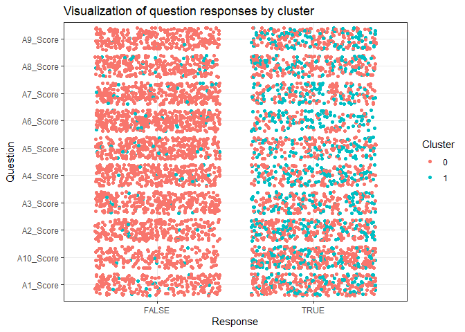
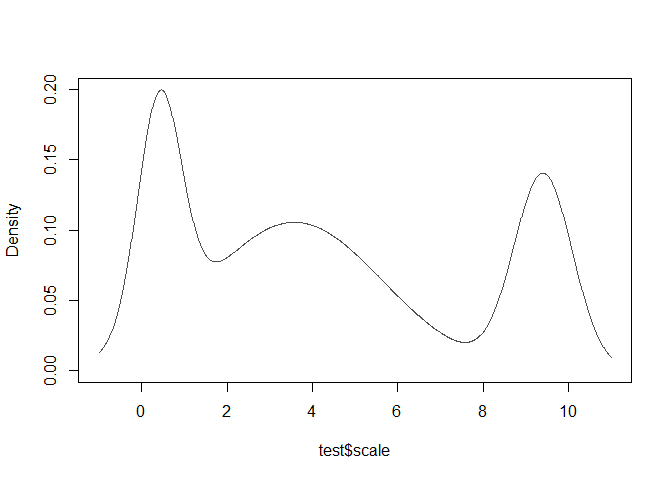
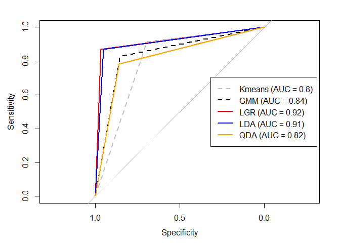

PREDICTING AUTISM SPECTRUM DISORDER:UNSUPERVISED VS. SUPERVISED METHODS
================
Nuno Fernandes
2022-06-08

# Introduction

The prediction of the Autism Spectrum Disorder (ASD) has been widely
studied, both using unsupervised (Parlett-Pelleriti et al. (2022) for a
systematic review) and supervised methods (Karim et al. (2021) for a
systematic review).

ASD is a neurodevelopmental disorder characterized by social
communication and interaction deficits, and restricted, repetitive
patterns of interests and behaviors that become evident in early
childhood (APA, 2013).

The objective of the present work was to compare the performance of
supervised and unsupervised algorithms on ASD using the data set
provided by REVA Academy for Corporate Excellence, REVA University under
the Kaagle competition: Autism Prediction Challenge. I expected that
supervised methods would show a better performance.

# Preprocessing

#### read csv & train-test split

``` r
df = read.csv("train.csv")

## 75% of the sample size
smp_size <- floor(0.75 * nrow(df))

## set the seed to make your partition reproducible
set.seed(123)
train_ind <- sample(seq_len(nrow(df)), size = smp_size)

df <- df[train_ind, ]
test <- df[-train_ind, ]
```

``` r
head(df)
```

    ##      ID A1_Score A2_Score A3_Score A4_Score A5_Score A6_Score A7_Score A8_Score
    ## 415 415        0        1        1        0        0        1        0        1
    ## 463 463        1        1        1        0        0        0        0        0
    ## 179 179        1        0        1        1        1        1        0        1
    ## 526 526        1        0        0        1        0        0        1        0
    ## 195 195        0        0        0        0        0        0        0        0
    ## 118 118        0        0        0        0        0        0        0        0
    ##     A9_Score A10_Score      age gender       ethnicity jaundice austim
    ## 415        1         0 11.28569      f  White-European       no     no
    ## 463        1         0 21.39827      m  White-European      yes     no
    ## 179        1         1 29.43108      f               ?      yes     no
    ## 526        1         1 23.39377      m Middle Eastern        no     no
    ## 195        0         1 22.48167      m Middle Eastern        no     no
    ## 118        0         0 14.36079      m Middle Eastern       yes     no
    ##     contry_of_res used_app_before     result    age_desc relation Class.ASD
    ## 415 United States              no 10.5827136 18 and more     Self         0
    ## 463          Iran              no  9.2905592 18 and more     Self         0
    ## 179   Afghanistan              no 13.2076356 18 and more     Self         0
    ## 526     Australia              no -0.1482314 18 and more     Self         0
    ## 195       Bahamas              no -1.0320832 18 and more        ?         0
    ## 118   New Zealand             yes 10.6379178 18 and more     Self         0


``` r
str(df)
```

    ## 'data.frame':    600 obs. of  22 variables:
    ##  $ ID             : int  415 463 179 526 195 118 299 229 244 14 ...
    ##  $ A1_Score       : int  0 1 1 1 0 0 1 1 1 1 ...
    ##  $ A2_Score       : int  1 1 0 0 0 0 1 1 1 1 ...
    ##  $ A3_Score       : int  1 1 1 0 0 0 1 1 1 1 ...
    ##  $ A4_Score       : int  0 0 1 1 0 0 1 0 1 0 ...
    ##  $ A5_Score       : int  0 0 1 0 0 0 1 1 0 1 ...
    ##  $ A6_Score       : int  1 0 1 0 0 0 0 0 0 1 ...
    ##  $ A7_Score       : int  0 0 0 1 0 0 1 1 0 1 ...
    ##  $ A8_Score       : int  1 0 1 0 0 0 1 1 0 1 ...
    ##  $ A9_Score       : int  1 1 1 1 0 0 1 1 0 1 ...
    ##  $ A10_Score      : int  0 0 1 1 1 0 1 1 1 0 ...
    ##  $ age            : num  11.3 21.4 29.4 23.4 22.5 ...
    ##  $ gender         : chr  "f" "m" "f" "m" ...
    ##  $ ethnicity      : chr  "White-European" "White-European" "?" "Middle Eastern " ...
    ##  $ jaundice       : chr  "no" "yes" "yes" "no" ...
    ##  $ austim         : chr  "no" "no" "no" "no" ...
    ##  $ contry_of_res  : chr  "United States" "Iran" "Afghanistan" "Australia" ...
    ##  $ used_app_before: chr  "no" "no" "no" "no" ...
    ##  $ result         : num  10.583 9.291 13.208 -0.148 -1.032 ...
    ##  $ age_desc       : chr  "18 and more" "18 and more" "18 and more" "18 and more" ...
    ##  $ relation       : chr  "Self" "Self" "Self" "Self" ...
    ##  $ Class.ASD      : int  0 0 0 0 0 0 0 0 0 0 ...

``` r
#train
df$contry_of_res[df$contry_of_res=="United States"] = "aaaUS"

df$ethnicity[df$ethnicity == "?"] == "Others"
df$ethnicity[df$ethnicity == "White-European"] = "aaaWhite-European0"

#test
test$contry_of_res[test$contry_of_res=="United States"] = "aaaUS"

test$ethnicity[test$ethnicity == "?"] == "Others"
test$ethnicity[test$ethnicity == "White-European"] = "aaaWhite-European0"

cols = c("ID","A1_Score","A2_Score","A3_Score","A4_Score","A5_Score","A6_Score","A7_Score","A8_Score","A9_Score","A10_Score","gender","ethnicity","jaundice","austim","contry_of_res","used_app_before","age_desc","relation","Class.ASD")
df %>%
       mutate_each_(funs(factor(.)),cols) -> df

#test
test %>%
       mutate_each_(funs(factor(.)),cols) -> test
```

``` r
str(df)
```

    ## 'data.frame':    600 obs. of  22 variables:
    ##  $ ID             : Factor w/ 600 levels "2","4","5","6",..: 311 347 133 394 145 86 225 173 186 10 ...
    ##  $ A1_Score       : Factor w/ 2 levels "0","1": 1 2 2 2 1 1 2 2 2 2 ...
    ##  $ A2_Score       : Factor w/ 2 levels "0","1": 2 2 1 1 1 1 2 2 2 2 ...
    ##  $ A3_Score       : Factor w/ 2 levels "0","1": 2 2 2 1 1 1 2 2 2 2 ...
    ##  $ A4_Score       : Factor w/ 2 levels "0","1": 1 1 2 2 1 1 2 1 2 1 ...
    ##  $ A5_Score       : Factor w/ 2 levels "0","1": 1 1 2 1 1 1 2 2 1 2 ...
    ##  $ A6_Score       : Factor w/ 2 levels "0","1": 2 1 2 1 1 1 1 1 1 2 ...
    ##  $ A7_Score       : Factor w/ 2 levels "0","1": 1 1 1 2 1 1 2 2 1 2 ...
    ##  $ A8_Score       : Factor w/ 2 levels "0","1": 2 1 2 1 1 1 2 2 1 2 ...
    ##  $ A9_Score       : Factor w/ 2 levels "0","1": 2 2 2 2 1 1 2 2 1 2 ...
    ##  $ A10_Score      : Factor w/ 2 levels "0","1": 1 1 2 2 2 1 2 2 2 1 ...
    ##  $ age            : num  11.3 21.4 29.4 23.4 22.5 ...
    ##  $ gender         : Factor w/ 2 levels "f","m": 1 2 1 2 2 2 2 2 2 1 ...
    ##  $ ethnicity      : Factor w/ 12 levels "?","aaaWhite-European0",..: 2 2 1 7 7 7 2 2 2 10 ...
    ##  $ jaundice       : Factor w/ 2 levels "no","yes": 1 2 2 1 1 2 2 1 1 1 ...
    ##  $ austim         : Factor w/ 2 levels "no","yes": 1 1 1 1 1 1 1 1 1 1 ...
    ##  $ contry_of_res  : Factor w/ 53 levels "aaaUS","Afghanistan",..: 1 26 2 8 11 36 17 17 1 52 ...
    ##  $ used_app_before: Factor w/ 2 levels "no","yes": 1 1 1 1 1 2 2 1 1 1 ...
    ##  $ result         : num  10.583 9.291 13.208 -0.148 -1.032 ...
    ##  $ age_desc       : Factor w/ 1 level "18 and more": 1 1 1 1 1 1 1 1 1 1 ...
    ##  $ relation       : Factor w/ 6 levels "?","Health care professional",..: 6 6 6 6 1 6 6 6 6 6 ...
    ##  $ Class.ASD      : Factor w/ 2 levels "0","1": 1 1 1 1 1 1 1 1 1 1 ...

#### Autism Screening Questionnaire (AQ-10)

``` r
df[,2:11]= sapply(df[, 2:11], as.character)
df[,2:11]= sapply(df[, 2:11], as.numeric)

test[,2:11]= sapply(test[, 2:11], as.character)
test[,2:11]= sapply(test[, 2:11], as.numeric)


df = df %>%rowwise() %>% mutate(scale =sum(c(A1_Score,A2_Score,A3_Score,A4_Score,A5_Score,A6_Score,A7_Score,A8_Score,A9_Score,A10_Score)))

test = test %>% rowwise() %>% mutate(scale =sum(c(A1_Score,A2_Score,A3_Score,A4_Score,A5_Score,A6_Score,A7_Score,A8_Score,A9_Score,A10_Score)))
```

#### Plot responses per cluster

``` r
fig.labelled_respondents <- df %>% 
  pivot_longer(cols = cols[2:11], names_to = "question", values_to = "response") %>% 
  mutate(response = response == 1) %>% 
  ggplot(aes(x = response, y = question, color = Class.ASD)) +
  geom_jitter() +
  theme_bw() +
  labs(x = "Response", y = "Question", color = "Cluster",
       title = "Visualization of question responses by cluster")

fig.labelled_respondents
```

<!-- -->

# Unsupervised methods

## K-Means

``` r
clustering = kmeans(test[,c("scale")], centers = 2, nstart = 1)
```

\#Results to dataframe

``` r
cluster = data.frame(clustering$cluster)
#recode levels
cluster$clustering.cluster[cluster$clustering.cluster==2] = 0
cluster$clustering.cluster = as.factor(cluster$clustering.cluster)
```

#### Internal validity

``` r
kmeans_internal = intCriteria(as.matrix(test$scale),clustering$cluster,"all")
```

#### External validity

``` r
vector1 = as.vector(as.integer(cluster$clustering.cluster))
vector2 = as.vector(as.integer(test$Class.ASD))

extCriteria(vector1, vector2,"all")
```

    ## $czekanowski_dice
    ## [1] 0.6806021
    ## 
    ## $folkes_mallows
    ## [1] 0.6908966
    ## 
    ## $hubert
    ## [1] 0.2143133
    ## 
    ## $jaccard
    ## [1] 0.515843
    ## 
    ## $kulczynski
    ## [1] 0.7013468
    ## 
    ## $mcnemar
    ## [1] -34.45733
    ## 
    ## $phi
    ## [1] 9.108715e-09
    ## 
    ## $precision
    ## [1] 0.5807267
    ## 
    ## $rand
    ## [1] 0.6022727
    ## 
    ## $recall
    ## [1] 0.8219668
    ## 
    ## $rogers_tanimoto
    ## [1] 0.4308943
    ## 
    ## $russel_rao
    ## [1] 0.4237568
    ## 
    ## $sokal_sneath1
    ## [1] 0.3475663
    ## 
    ## $sokal_sneath2
    ## [1] 0.751773

## Gaussian Mixture Models (GMM)

``` r
gmm_test = Mclust(test$scale)
```

#### Density plot

``` r
densityMclust(test$scale)
```

<!-- -->

    ## 'densityMclust' model object: (V,3) 
    ## 
    ## Available components: 
    ##  [1] "call"           "data"           "modelName"      "n"             
    ##  [5] "d"              "G"              "BIC"            "loglik"        
    ##  [9] "df"             "bic"            "icl"            "hypvol"        
    ## [13] "parameters"     "z"              "classification" "uncertainty"   
    ## [17] "density"

#### Internal validity (Kmeans vs GMM)

``` r
gmm_internal = intCriteria(as.matrix(test$scale),as.vector(as.integer(gmm_test$classification)),"all")

new = list()

for (i in 1:length(kmeans_internal)){
  new = append(new,list(cbind(kmeans_internal[i],gmm_internal[i])))
}

new
```

    ## [[1]]
    ##           [,1]     [,2]    
    ## ball_hall 2.538403 1.179024
    ## 
    ## [[2]]
    ##                 [,1]     [,2]     
    ## banfeld_raftery 121.7111 -12.97624
    ## 
    ## [[3]]
    ##         [,1]       [,2]      
    ## c_index 0.04163303 0.06455702
    ## 
    ## [[4]]
    ##                   [,1]     [,2]    
    ## calinski_harabasz 579.3592 517.3591
    ## 
    ## [[5]]
    ##                [,1]      [,2]     
    ## davies_bouldin 0.4327414 0.5025916
    ## 
    ## [[6]]
    ##           [,1]     [,2]    
    ## det_ratio 5.079995 8.338427
    ## 
    ## [[7]]
    ##      [,1] [,2]
    ## dunn 0.2  0.2 
    ## 
    ## [[8]]
    ##       [,1]      [,2]    
    ## gamma 0.9435833 0.885217
    ## 
    ## [[9]]
    ##        [,1]       [,2]      
    ## g_plus 0.01409192 0.02620649
    ## 
    ## [[10]]
    ##       [,1] [,2]
    ## gdi11 0.2  0.2 
    ## 
    ## [[11]]
    ##       [,1]      [,2]    
    ## gdi12 0.9910072 1.068493
    ## 
    ## [[12]]
    ##       [,1]      [,2]     
    ## gdi13 0.3166416 0.3548387
    ## 
    ## [[13]]
    ##       [,1] [,2]
    ## gdi21 2    1.4 
    ## 
    ## [[14]]
    ##       [,1]     [,2]    
    ## gdi22 9.910072 7.479452
    ## 
    ## [[15]]
    ##       [,1]     [,2]    
    ## gdi23 3.166416 2.483871
    ## 
    ## [[16]]
    ##       [,1]     [,2]     
    ## gdi31 1.278829 0.6739837
    ## 
    ## [[17]]
    ##       [,1]     [,2]    
    ## gdi32 6.336645 3.600735
    ## 
    ## [[18]]
    ##       [,1]     [,2]    
    ## gdi33 2.024652 1.195778
    ## 
    ## [[19]]
    ##       [,1]     [,2]     
    ## gdi41 1.278829 0.6739837
    ## 
    ## [[20]]
    ##       [,1]     [,2]    
    ## gdi42 6.336645 3.600735
    ## 
    ## [[21]]
    ##       [,1]     [,2]    
    ## gdi43 2.024652 1.195778
    ## 
    ## [[22]]
    ##       [,1]      [,2]     
    ## gdi51 0.2690958 0.1146527
    ## 
    ## [[23]]
    ##       [,1]    [,2]     
    ## gdi52 1.33338 0.6125283
    ## 
    ## [[24]]
    ##       [,1]      [,2]     
    ## gdi53 0.4260346 0.2034161
    ## 
    ## [[25]]
    ##          [,1]     [,2]    
    ## ksq_detw 1388.447 1903.229
    ## 
    ## [[26]]
    ##               [,1]     [,2]    
    ## log_det_ratio 234.0447 305.4059
    ## 
    ## [[27]]
    ##              [,1]     [,2]    
    ## log_ss_ratio 1.406096 1.993125
    ## 
    ## [[28]]
    ##             [,1]     [,2]     
    ## mcclain_rao 0.266263 0.2531644
    ## 
    ## [[29]]
    ##     [,1]     [,2]    
    ## pbm 53.42926 90.26249
    ## 
    ## [[30]]
    ##                [,1]      [,2]     
    ## point_biserial -2.344677 -1.925794
    ## 
    ## [[31]]
    ##          [,1]       [,2]     
    ## ray_turi 0.05895788 0.1293145
    ## 
    ## [[32]]
    ##                 [,1]      [,2]     
    ## ratkowsky_lance 0.6336992 0.5416251
    ## 
    ## [[33]]
    ##              [,1]     [,2]     
    ## scott_symons 121.7111 -12.97624
    ## 
    ## [[34]]
    ##         [,1]      [,2]      
    ## sd_scat 0.2072957 0.09628366
    ## 
    ## [[35]]
    ##        [,1]      [,2]     
    ## sd_dis 0.3127861 0.6949356
    ## 
    ## [[36]]
    ##       [,1]     [,2]    
    ## s_dbw 0.917822 1.636621
    ## 
    ## [[37]]
    ##            [,1]      [,2]     
    ## silhouette 0.6793455 0.6373087
    ## 
    ## [[38]]
    ##     [,1]      [,2]     
    ## tau 0.6669242 0.5981781
    ## 
    ## [[39]]
    ##         [,1]     [,2]    
    ## trace_w 347.1119 211.4699
    ## 
    ## [[40]]
    ##           [,1]     [,2]    
    ## trace_wib 4.079995 7.338427
    ## 
    ## [[41]]
    ##                   [,1]      [,2]     
    ## wemmert_gancarski 0.7550546 0.6245526
    ## 
    ## [[42]]
    ##          [,1]     [,2]    
    ## xie_beni 2.410499 1.468541

Overall, KMeans showed a greater internal validity compared to GMM.

#### Confusion matrix

``` r
classifications = gmm_test$classification

for(i in 1:length(classifications)){
  if (classifications[i]<= 2){
    classifications[i] = 0
  }
  else {
    classifications[i] = 1
  }
}
confusionMatrix(test$Class.ASD, factor(classifications))
```

    ## Confusion Matrix and Statistics
    ## 
    ##           Reference
    ## Prediction   0   1
    ##          0 103  18
    ##          1   4  19
    ##                                           
    ##                Accuracy : 0.8472          
    ##                  95% CI : (0.7779, 0.9017)
    ##     No Information Rate : 0.7431          
    ##     P-Value [Acc > NIR] : 0.001884        
    ##                                           
    ##                   Kappa : 0.5434          
    ##                                           
    ##  Mcnemar's Test P-Value : 0.005578        
    ##                                           
    ##             Sensitivity : 0.9626          
    ##             Specificity : 0.5135          
    ##          Pos Pred Value : 0.8512          
    ##          Neg Pred Value : 0.8261          
    ##              Prevalence : 0.7431          
    ##          Detection Rate : 0.7153          
    ##    Detection Prevalence : 0.8403          
    ##       Balanced Accuracy : 0.7381          
    ##                                           
    ##        'Positive' Class : 0               
    ## 

#### External validity

``` r
vector1 = as.vector(as.integer(gmm_test$classification))
vector2 = as.vector(as.integer(test$Class.ASD))

extCriteria(vector1, vector2,"all")
```

    ## $czekanowski_dice
    ## [1] 0.5457646
    ## 
    ## $folkes_mallows
    ## [1] 0.5822327
    ## 
    ## $hubert
    ## [1] 0.1791741
    ## 
    ## $jaccard
    ## [1] 0.3752931
    ## 
    ## $kulczynski
    ## [1] 0.6211377
    ## 
    ## $mcnemar
    ## [1] -54.56252
    ## 
    ## $phi
    ## [1] 7.965237e-09
    ## 
    ## $precision
    ## [1] 0.4047651
    ## 
    ## $rand
    ## [1] 0.5083528
    ## 
    ## $recall
    ## [1] 0.8375103
    ## 
    ## $rogers_tanimoto
    ## [1] 0.3407996
    ## 
    ## $russel_rao
    ## [1] 0.2953574
    ## 
    ## $sokal_sneath1
    ## [1] 0.2309913
    ## 
    ## $sokal_sneath2
    ## [1] 0.6740502

# Supervised-learning

## LGR

``` r
model1 = glm(Class.ASD~age + gender + ethnicity + jaundice + austim + contry_of_res + used_app_before + scale + relation, data=df, family=binomial)
```

    ## Warning: glm.fit: fitted probabilities numerically 0 or 1 occurred

``` r
summary(model1)
```

    ## 
    ## Call:
    ## glm(formula = Class.ASD ~ age + gender + ethnicity + jaundice + 
    ##     austim + contry_of_res + used_app_before + scale + relation, 
    ##     family = binomial, data = df)
    ## 
    ## Deviance Residuals: 
    ##      Min        1Q    Median        3Q       Max  
    ## -2.29318  -0.23933  -0.02962  -0.00001   2.68349  
    ## 
    ## Coefficients: (1 not defined because of singularities)
    ##                                     Estimate Std. Error z value Pr(>|z|)    
    ## (Intercept)                       -7.077e+00  1.534e+00  -4.614 3.95e-06 ***
    ## age                                2.166e-02  1.043e-02   2.077   0.0378 *  
    ## genderm                            2.587e-01  3.636e-01   0.712   0.4768    
    ## ethnicityaaaWhite-European0        1.246e+00  6.944e-01   1.794   0.0728 .  
    ## ethnicityAsian                     1.923e+00  1.092e+00   1.760   0.0784 .  
    ## ethnicityBlack                     9.837e-02  9.682e-01   0.102   0.9191    
    ## ethnicityHispanic                  7.029e-01  1.412e+00   0.498   0.6186    
    ## ethnicityLatino                    1.743e+00  1.338e+00   1.302   0.1928    
    ## ethnicityMiddle Eastern            1.532e+00  8.876e-01   1.726   0.0843 .  
    ## ethnicityothers                   -1.423e+01  1.250e+04  -0.001   0.9991    
    ## ethnicityOthers                    1.129e+00  1.215e+00   0.929   0.3529    
    ## ethnicityPasifika                  1.049e+00  1.047e+00   1.003   0.3161    
    ## ethnicitySouth Asian               1.159e+00  1.203e+00   0.963   0.3353    
    ## ethnicityTurkish                  -1.858e+01  8.848e+03  -0.002   0.9983    
    ## jaundiceyes                       -1.739e-01  3.646e-01  -0.477   0.6333    
    ## austimyes                          5.114e-01  3.921e-01   1.304   0.1921    
    ## contry_of_resAfghanistan          -2.533e+00  1.322e+00  -1.915   0.0555 .  
    ## contry_of_resAmericanSamoa        -1.978e+01  8.883e+03  -0.002   0.9982    
    ## contry_of_resAngola               -1.587e+01  1.773e+04  -0.001   0.9993    
    ## contry_of_resArgentina            -1.637e+01  1.773e+04  -0.001   0.9993    
    ## contry_of_resArmenia               2.002e+01  1.251e+04   0.002   0.9987    
    ## contry_of_resAruba                 1.893e+01  1.244e+04   0.002   0.9988    
    ## contry_of_resAustralia             8.752e-01  7.330e-01   1.194   0.2325    
    ## contry_of_resAustria              -1.729e+01  4.332e+03  -0.004   0.9968    
    ## contry_of_resAzerbaijan            3.328e+00  1.900e+00   1.751   0.0799 .  
    ## contry_of_resBahamas               6.713e-01  1.289e+00   0.521   0.6025    
    ## contry_of_resBangladesh           -2.147e+01  1.773e+04  -0.001   0.9990    
    ## contry_of_resBolivia              -1.422e+01  1.773e+04  -0.001   0.9994    
    ## contry_of_resBrazil               -8.210e-01  1.744e+00  -0.471   0.6378    
    ## contry_of_resBurundi               2.017e+01  1.773e+04   0.001   0.9991    
    ## contry_of_resCanada               -5.452e-02  7.510e-01  -0.073   0.9421    
    ## contry_of_resChina                -2.036e+01  7.762e+03  -0.003   0.9979    
    ## contry_of_resCyprus                1.254e+00  1.557e+00   0.805   0.4206    
    ## contry_of_resEgypt                -1.921e+01  1.773e+04  -0.001   0.9991    
    ## contry_of_resEthiopia              3.805e+00  1.910e+00   1.992   0.0464 *  
    ## contry_of_resFrance                1.473e+00  1.095e+00   1.345   0.1786    
    ## contry_of_resGermany              -1.963e+01  8.477e+03  -0.002   0.9982    
    ## contry_of_resHong Kong            -2.081e+01  1.773e+04  -0.001   0.9991    
    ## contry_of_resIceland              -1.781e+01  9.164e+03  -0.002   0.9984    
    ## contry_of_resIndia                -1.410e+00  7.454e-01  -1.891   0.0586 .  
    ## contry_of_resIran                 -8.015e-01  1.507e+00  -0.532   0.5947    
    ## contry_of_resIraq                 -2.114e+01  7.552e+03  -0.003   0.9978    
    ## contry_of_resIreland              -1.675e+00  1.278e+00  -1.311   0.1900    
    ## contry_of_resItaly                 1.573e+00  1.657e+00   0.950   0.3423    
    ## contry_of_resJapan                -1.780e+01  1.773e+04  -0.001   0.9992    
    ## contry_of_resJordan               -1.271e+00  9.786e-01  -1.299   0.1940    
    ## contry_of_resKazakhstan           -9.396e-01  1.139e+00  -0.825   0.4092    
    ## contry_of_resMalaysia              1.395e+00  1.417e+00   0.984   0.3250    
    ## contry_of_resMexico               -1.792e+01  8.059e+03  -0.002   0.9982    
    ## contry_of_resNetherlands          -2.030e+00  1.202e+00  -1.688   0.0915 .  
    ## contry_of_resNew Zealand          -1.805e+01  1.929e+03  -0.009   0.9925    
    ## contry_of_resNicaragua            -2.007e+01  7.112e+03  -0.003   0.9977    
    ## contry_of_resNiger                -2.197e+01  1.773e+04  -0.001   0.9990    
    ## contry_of_resOman                  2.033e+01  1.224e+04   0.002   0.9987    
    ## contry_of_resPakistan             -2.232e-01  1.478e+00  -0.151   0.8800    
    ## contry_of_resRomania              -1.748e+01  1.773e+04  -0.001   0.9992    
    ## contry_of_resRussia               -1.934e+01  6.011e+03  -0.003   0.9974    
    ## contry_of_resSaudi Arabia         -1.760e+01  1.247e+04  -0.001   0.9989    
    ## contry_of_resSerbia               -1.661e+01  9.516e+03  -0.002   0.9986    
    ## contry_of_resSierra Leone         -1.778e+01  1.773e+04  -0.001   0.9992    
    ## contry_of_resSouth Africa         -1.587e+01  7.755e+03  -0.002   0.9984    
    ## contry_of_resSpain                -2.740e-02  1.261e+00  -0.022   0.9827    
    ## contry_of_resSri Lanka            -1.862e+01  3.960e+03  -0.005   0.9962    
    ## contry_of_resSweden               -2.192e+01  1.773e+04  -0.001   0.9990    
    ## contry_of_resUkraine               5.414e-01  2.567e+00   0.211   0.8329    
    ## contry_of_resUnited Arab Emirates -1.729e+01  2.763e+03  -0.006   0.9950    
    ## contry_of_resUnited Kingdom       -4.354e-01  4.798e-01  -0.907   0.3642    
    ## contry_of_resViet Nam              7.849e-01  1.697e+00   0.462   0.6438    
    ## used_app_beforeyes                -1.542e-01  7.706e-01  -0.200   0.8414    
    ## scale                              6.643e-01  1.095e-01   6.064 1.33e-09 ***
    ## relationHealth care professional          NA         NA      NA       NA    
    ## relationOthers                    -2.008e+01  1.036e+04  -0.002   0.9985    
    ## relationParent                    -2.954e-01  1.613e+00  -0.183   0.8547    
    ## relationRelative                   1.468e-01  1.768e+00   0.083   0.9338    
    ## relationSelf                      -3.093e-01  1.231e+00  -0.251   0.8016    
    ## ---
    ## Signif. codes:  0 '***' 0.001 '**' 0.01 '*' 0.05 '.' 0.1 ' ' 1
    ## 
    ## (Dispersion parameter for binomial family taken to be 1)
    ## 
    ##     Null deviance: 580.56  on 599  degrees of freedom
    ## Residual deviance: 247.12  on 526  degrees of freedom
    ## AIC: 395.12
    ## 
    ## Number of Fisher Scoring iterations: 19

Selected only sig. predictors.

``` r
model2 = glm(Class.ASD~ + ethnicity + jaundice + austim + contry_of_res  + factor(A3_Score)+factor(A4_Score)+factor(A6_Score)+factor(A9_Score) , data=df, family=binomial)
```

    ## Warning: glm.fit: fitted probabilities numerically 0 or 1 occurred

``` r
summary(model2)
```

    ## 
    ## Call:
    ## glm(formula = Class.ASD ~ +ethnicity + jaundice + austim + contry_of_res + 
    ##     factor(A3_Score) + factor(A4_Score) + factor(A6_Score) + 
    ##     factor(A9_Score), family = binomial, data = df)
    ## 
    ## Deviance Residuals: 
    ##      Min        1Q    Median        3Q       Max  
    ## -1.97922  -0.21829  -0.03326  -0.00001   3.04454  
    ## 
    ## Coefficients:
    ##                                     Estimate Std. Error z value Pr(>|z|)    
    ## (Intercept)                       -5.869e+00  9.683e-01  -6.061 1.36e-09 ***
    ## ethnicityaaaWhite-European0        1.610e+00  6.831e-01   2.358 0.018386 *  
    ## ethnicityAsian                     1.987e+00  1.096e+00   1.814 0.069672 .  
    ## ethnicityBlack                     7.349e-01  9.609e-01   0.765 0.444376    
    ## ethnicityHispanic                  7.570e-01  1.407e+00   0.538 0.590626    
    ## ethnicityLatino                    1.814e+00  1.229e+00   1.476 0.140028    
    ## ethnicityMiddle Eastern            1.661e+00  9.103e-01   1.825 0.068030 .  
    ## ethnicityothers                   -1.504e+01  1.248e+04  -0.001 0.999039    
    ## ethnicityOthers                    9.515e-01  1.176e+00   0.809 0.418653    
    ## ethnicityPasifika                  1.198e+00  9.905e-01   1.210 0.226322    
    ## ethnicitySouth Asian               1.987e+00  1.241e+00   1.602 0.109244    
    ## ethnicityTurkish                  -1.815e+01  8.740e+03  -0.002 0.998343    
    ## jaundiceyes                       -2.301e-01  3.573e-01  -0.644 0.519650    
    ## austimyes                          7.010e-01  3.816e-01   1.837 0.066224 .  
    ## contry_of_resAfghanistan          -2.318e+00  1.215e+00  -1.907 0.056521 .  
    ## contry_of_resAmericanSamoa        -2.026e+01  8.821e+03  -0.002 0.998167    
    ## contry_of_resAngola               -1.564e+01  1.773e+04  -0.001 0.999296    
    ## contry_of_resArgentina            -1.631e+01  1.773e+04  -0.001 0.999266    
    ## contry_of_resArmenia               1.958e+01  1.251e+04   0.002 0.998751    
    ## contry_of_resAruba                 1.924e+01  1.244e+04   0.002 0.998766    
    ## contry_of_resAustralia             5.223e-01  7.118e-01   0.734 0.463144    
    ## contry_of_resAustria              -1.729e+01  4.384e+03  -0.004 0.996852    
    ## contry_of_resAzerbaijan            2.865e+00  1.687e+00   1.698 0.089499 .  
    ## contry_of_resBahamas               7.240e-01  1.265e+00   0.572 0.567023    
    ## contry_of_resBangladesh           -2.237e+01  1.773e+04  -0.001 0.998993    
    ## contry_of_resBolivia              -1.470e+01  1.773e+04  -0.001 0.999339    
    ## contry_of_resBrazil               -7.078e-03  2.018e+00  -0.004 0.997202    
    ## contry_of_resBurundi               2.087e+01  1.773e+04   0.001 0.999061    
    ## contry_of_resCanada               -2.621e-01  7.549e-01  -0.347 0.728452    
    ## contry_of_resChina                -2.073e+01  7.251e+03  -0.003 0.997719    
    ## contry_of_resCyprus                1.140e+00  1.588e+00   0.718 0.472731    
    ## contry_of_resEgypt                -1.879e+01  1.773e+04  -0.001 0.999155    
    ## contry_of_resEthiopia              3.644e+00  1.895e+00   1.923 0.054440 .  
    ## contry_of_resFrance                1.271e+00  1.136e+00   1.119 0.262994    
    ## contry_of_resGermany              -1.940e+01  8.699e+03  -0.002 0.998221    
    ## contry_of_resHong Kong            -1.949e+01  1.773e+04  -0.001 0.999123    
    ## contry_of_resIceland              -1.705e+01  9.406e+03  -0.002 0.998554    
    ## contry_of_resIndia                -1.631e+00  7.386e-01  -2.209 0.027201 *  
    ## contry_of_resIran                 -8.082e-01  1.351e+00  -0.598 0.549816    
    ## contry_of_resIraq                 -2.035e+01  7.908e+03  -0.003 0.997947    
    ## contry_of_resIreland              -1.638e+00  1.246e+00  -1.314 0.188721    
    ## contry_of_resItaly                 2.526e-01  1.413e+00   0.179 0.858099    
    ## contry_of_resJapan                -1.651e+01  1.773e+04  -0.001 0.999257    
    ## contry_of_resJordan               -9.222e-01  9.510e-01  -0.970 0.332206    
    ## contry_of_resKazakhstan           -9.504e-01  1.088e+00  -0.874 0.382205    
    ## contry_of_resMalaysia              1.358e+00  1.781e+00   0.763 0.445760    
    ## contry_of_resMexico               -1.823e+01  8.058e+03  -0.002 0.998195    
    ## contry_of_resNetherlands          -2.121e+00  1.184e+00  -1.791 0.073267 .  
    ## contry_of_resNew Zealand          -1.813e+01  1.964e+03  -0.009 0.992637    
    ## contry_of_resNicaragua            -1.972e+01  7.178e+03  -0.003 0.997808    
    ## contry_of_resNiger                -2.214e+01  1.773e+04  -0.001 0.999004    
    ## contry_of_resOman                  2.055e+01  1.164e+04   0.002 0.998591    
    ## contry_of_resPakistan              8.375e-01  1.533e+00   0.546 0.584848    
    ## contry_of_resRomania              -1.847e+01  1.773e+04  -0.001 0.999169    
    ## contry_of_resRussia               -1.839e+01  6.183e+03  -0.003 0.997626    
    ## contry_of_resSaudi Arabia         -1.627e+01  1.236e+04  -0.001 0.998950    
    ## contry_of_resSerbia               -1.605e+01  9.899e+03  -0.002 0.998706    
    ## contry_of_resSierra Leone         -1.814e+01  1.773e+04  -0.001 0.999184    
    ## contry_of_resSouth Africa         -1.588e+01  7.779e+03  -0.002 0.998371    
    ## contry_of_resSpain                 1.306e-01  1.327e+00   0.098 0.921601    
    ## contry_of_resSri Lanka            -1.908e+01  3.981e+03  -0.005 0.996176    
    ## contry_of_resSweden               -2.157e+01  1.773e+04  -0.001 0.999029    
    ## contry_of_resUkraine               6.665e-01  2.686e+00   0.248 0.804029    
    ## contry_of_resUnited Arab Emirates -1.723e+01  2.791e+03  -0.006 0.995075    
    ## contry_of_resUnited Kingdom       -5.370e-01  4.715e-01  -1.139 0.254708    
    ## contry_of_resViet Nam              8.700e-01  1.707e+00   0.510 0.610323    
    ## factor(A3_Score)1                  9.471e-01  5.103e-01   1.856 0.063465 .  
    ## factor(A4_Score)1                  1.782e+00  4.618e-01   3.858 0.000114 ***
    ## factor(A6_Score)1                  1.103e+00  3.919e-01   2.815 0.004881 ** 
    ## factor(A9_Score)1                  1.532e+00  6.170e-01   2.482 0.013057 *  
    ## ---
    ## Signif. codes:  0 '***' 0.001 '**' 0.01 '*' 0.05 '.' 0.1 ' ' 1
    ## 
    ## (Dispersion parameter for binomial family taken to be 1)
    ## 
    ##     Null deviance: 580.56  on 599  degrees of freedom
    ## Residual deviance: 251.48  on 530  degrees of freedom
    ## AIC: 391.48
    ## 
    ## Number of Fisher Scoring iterations: 19

#### train

``` r
pred.prob = predict(model2, type="response")
pred.prob = ifelse(pred.prob > 0.5, 1, 0)
table(pred.prob, df$Class.ASD)
```

    ##          
    ## pred.prob   0   1
    ##         0 459  26
    ##         1  28  87

``` r
round(mean(pred.prob==df$Class.ASD),2)
```

    ## [1] 0.91

#### test

``` r
pred.prob = predict(model2, newdata= test, type="response")
pred.prob = ifelse(pred.prob > 0.5, 1, 0)
table(pred.prob, test$Class.ASD)
```

    ##          
    ## pred.prob   0   1
    ##         0 117   3
    ##         1   4  20

``` r
round(mean(pred.prob==test$Class.ASD),2)
```

    ## [1] 0.95

#### check mispredicted

``` r
cbind(test[c(5,31,38,45,52,66,83),"scale"], test[c(5,31,38,45,52,66,83),"Class.ASD"])
```

    ##   scale Class.ASD
    ## 1    10         0
    ## 2    10         0
    ## 3     9         0
    ## 4     6         1
    ## 5     4         1
    ## 6     6         1
    ## 7     9         0

## LDA

``` r
lda.model = lda(Class.ASD~ + ethnicity + jaundice + austim + contry_of_res  + factor(A3_Score)+factor(A4_Score)+factor(A6_Score)+factor(A9_Score) , data=df)
```

#### train

``` r
predmodel.train.lda = predict(lda.model, data=df)
table(Predicted=predmodel.train.lda$class, ASD=df$Class.ASD)
```

    ##          ASD
    ## Predicted   0   1
    ##         0 456  29
    ##         1  31  84

``` r
round(mean(predmodel.train.lda$class==df$Class.ASD),2)
```

    ## [1] 0.9

#### test

``` r
predmodel.test.lda = predict(lda.model, newdata=test)
table(Predicted=predmodel.test.lda$class, ASD=test$Class.ASD)
```

    ##          ASD
    ## Predicted   0   1
    ##         0 115   3
    ##         1   6  20

``` r
round(mean(predmodel.test.lda$class==test$Class.ASD),2)
```

    ## [1] 0.94

## QDA

``` r
#qda.model = qda (Class.ASD~ + ethnicity + jaundice + austim + contry_of_res  + scale , data=df)

qda.model = qda (Class.ASD~ + jaundice + austim + scale, data=df)

#qda.model = qda (Class.ASD~ factor(A3_Score)+factor(A4_Score)+factor(A6_Score)+factor(A9_Score) , data=df)
```

#### train

``` r
predmodel.train.qda = predict(qda.model, data=df)
table(Predicted=predmodel.train.qda$class, ASD=df$Class.ASD)
```

    ##          ASD
    ## Predicted   0   1
    ##         0 424  27
    ##         1  63  86

``` r
round(mean(predmodel.train.qda$class==df$Class.ASD),2)
```

    ## [1] 0.85

#### test

``` r
predmodel.test.qda = predict(qda.model, newdata=test)
table(Predicted=predmodel.test.qda$class, ASD=test$Class.ASD)
```

    ##          ASD
    ## Predicted   0   1
    ##         0 104   5
    ##         1  17  18

``` r
round(mean(predmodel.test.qda$class==test$Class.ASD),2)
```

    ## [1] 0.85

## Overview

### ROC-Curve

``` r
library("pROC")

roc_k_means= roc(test$Class.ASD,factor(cluster$clustering.cluster, ordered = T))

roc_gmm_uns = roc(test$Class.ASD, factor(classifications, ordered = T))

roc_lgr = roc(test$Class.ASD,factor(pred.prob, ordered = T))

roc_lda=roc(test$Class.ASD,factor(predmodel.test.lda$class, ordered = T))

roc_qda=roc(test$Class.ASD, factor(predmodel.test.qda$class, ordered = T))


plot(roc_k_means, col = 'grey',lty = 2)

plot(roc_gmm_uns, add=TRUE, col='black', lty = 2)

plot(roc_lgr, add=TRUE, col='red')
plot(roc_lda, add=TRUE, col='blue')
plot(roc_qda, add=TRUE, col='orange')


legend("right",
       inset = 0.01, # Distance from the margin
       legend = c(paste("Kmeans ", "(AUC = ", round(auc(roc_k_means),2),")" ,sep = ""), paste("GMM ", "(AUC = ", round(auc(roc_gmm_uns),2),")" ,sep = ""),paste("LGR ", "(AUC = ", round(auc(roc_lgr),2),")" ,sep = ""),paste("LDA ", "(AUC = ", round(auc(roc_lda),2),")" ,sep = ""),paste("QDA ", "(AUC = ", round(auc(roc_qda),2),")" ,sep = "")),
       lty = c(2, 2,1,1,1),
       col = c("grey","black","red","blue","orange"),
       lwd = 2)
```

<!-- -->

# Discussion

The present findings confirm my initial assumptions. Supervised methods
outperformed unsupervised ones. The model that appears to perform best
for this classification problem is the logistic regression (AUC = 0.92).
Although unsupervised methods showed an inferior performance, they may
provide new insights about the data. For example, GMM results suggest
that during an initial pre-screening, one should probably classify
individuals in 3 classes: no ASD, moderate probability of ASD, and
strong probability of ASD. Overall, this work presents a contribution to
the ASD prediction.

# References

Pierce, K. (2011). Early functional brain development in autism and the
promise of sleep fMRI. Brain Research, 1380, 162-174.
<https://doi.org/10.1016/j.brainres.2010.09.028>

American Psychiatric Association. (2013). Diagnostic and statistical
manual of mental disorders (5th ed.).
<https://doi.org/10.1176/appi.books.9780890425596>

Karim, S., Akter, N., Patwary, M. J. A., Islam, R. (2021). A Review on
Predicting Autism Spectrum Disorder(ASD) meltdown using Machine Learning
Algorithms. 5th International Conference on Electrical Engineering and
Information Communication Technology (ICEEICT) Military Institute of
Science and Technology (MIST).

Parlett-Pelleriti, C.M., Stevens, E., Dixon, D. et al. Applications of
Unsupervised Machine Learning in Autism Spectrum Disorder Research: a
Review. Rev J Autism Dev Disord (2022).
<https://doi.org/10.1007/s40489-021-00299-y>

Kashmar, Ali., & Shihab, A. I. (2020). Complexity Analysis of Time
Series and Applied Bioinformatics for Monitoring Of Autism Using Neural
Network and Statistical Techniques. International Journal of Engineering
and Technology.

<https://www.kaggle.com/competitions/autismdiagnosis/data>
